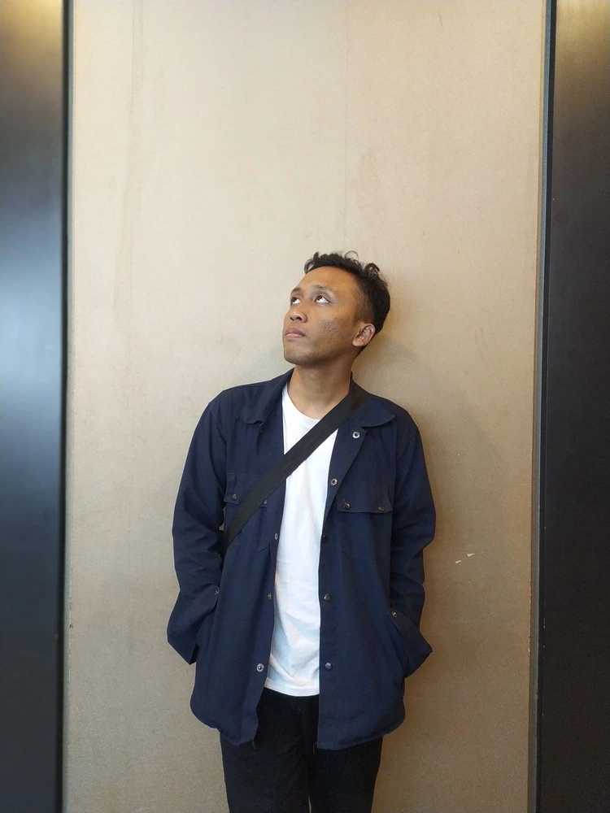

  

<h1 align="center">Rahmat Suhadi | Personal Portfolio</h1>

Halo! Ini adalah website portofolio pribadi saya yang dikembangkan untuk menyajikan Selected Works, riwayat karir, serta keahlian saya dalam pengembangan web secara interaktif dan modern.

---

### Tech Stack & Frameworks
* **Framework**: Next.js v16.2.6 (App Router / SSR)
* **Library**: React v19.2.4
* **Styling**: Tailwind CSS v4 (Modern Utility Classes)
* **Runtime / Packager**: Node.js & pnpm
* **Ikon**: FontAwesome 6 & Devicon CDN

---

### Fitur Utama
* **SSR (Server-Side Rendering)**: Kecepatan rendering maksimal untuk optimasi SEO terbaik.
* **Localization (Multilanguage - ID/EN)**: Deteksi bahasa browser otomatis secara dinamis, menyimpan preferensi di cookie, serta memelihara posisi scroll ketika user berganti bahasa.
* **Performa Tinggi**: Menggunakan optimalisasi gambar bawaan Next.js dan integrasi local font loader untuk meminimalisasi render-blocking resources.
* **Responsive Layout**: Navigasi desktop di atas dan navigasi mobile mengambang di bawah (floating bottom menu) yang responsif.
